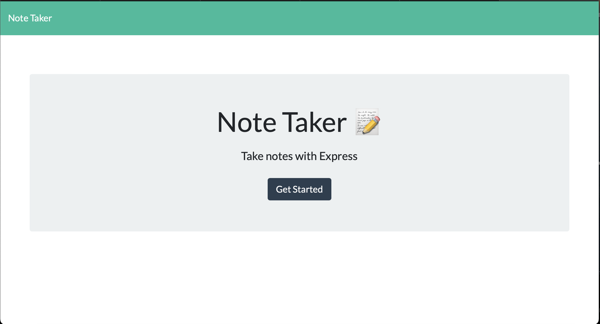
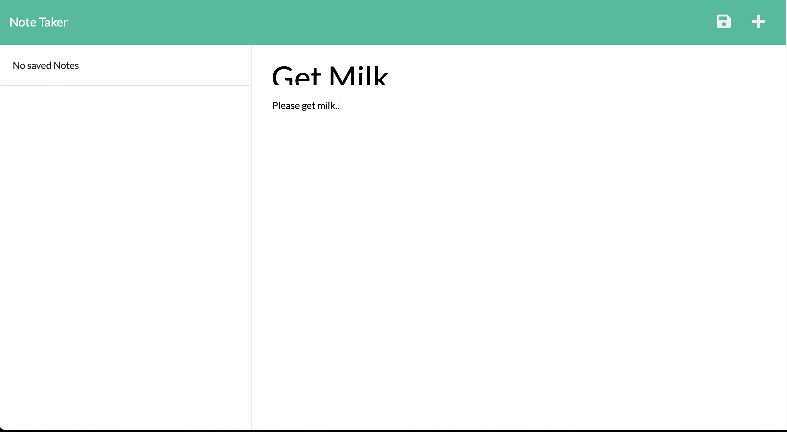

# Note Taker Website

## Description
This note taker website was created to store any notes you might need in a organized website that is accesible at any time.

## Installation
To start with installing, clone the repository. Then run "npm i" in the terminal. This will install all the necessary packages to make the website work.

## Usage
After everything is installed run "node server.js" in the terminal. This will boot the server and make it accesible on port 3001.

## Screen Shots

## Links
[Repo](https://github.com/WilliamHirschh/Note-Taker)

[Deployed Aplication](https://williamhirschh.github.io/Note-Taker/)
## License
MIT License 
